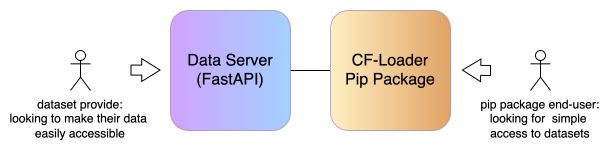
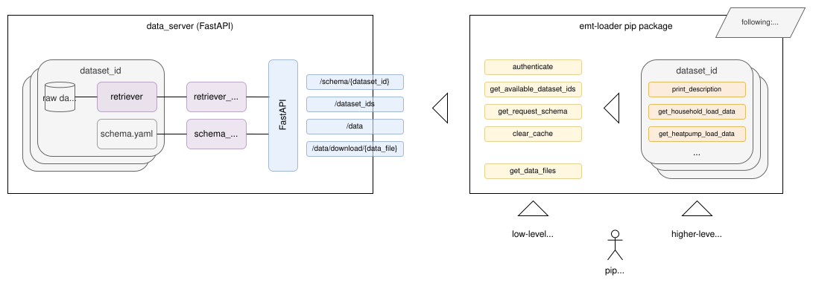

# common-fetch

Closing the gap between data providers and consumers.

---

## Key Features

### Addressed Problem

Data scientists frequently rely on heterogeneous datasets originating from different sources, formats, and access mechanisms. 
For a lot of domains and use cases, it would be highly beneficial to access these datasets through a standardized and unified API. 

The __common-fetch__ framework provides a simple white box framework for publishing data 
through a publicly accessible API and a Python package that enables consistent and convenient access.
Beyond that, it makes it as easy as possible to upload new datasets and make them accessible via the API.

The whole framework consists of two main parts:
- **Data 




> A working example implementation can be seen here: [TUM EMT Data Loader](https://gitlab.lrz.de/energy-management-technologies-public/data-loader)

### Easy Data Fetching

The EMT Data Loader is distributed as a Python pip package 
and provides a high-level, easy-to-use API for accessing connected datasets.
This allows users to retrieve complex datasets with minimal boilerplate code.
It offers:
- Common, standardized data getter functions
- Consistent return formats (e.g. pandas DataFrames)
- Optional customization via dataset-specific parameters

### Easy Integration of New Data Sources

Adding new data sources is simplified through the use of two core concepts on the server side:
- `schemas`, which define the structure and metadata of datasets
- `retrievers`, which handle the actual data acquisition and preprocessing

This separation enables developers to integrate new data sources in a structured and maintainable way,
making them automatically available to end users of the pip package (see below for details).

---

## Getting Started

This section provides two separate guides for different end-users:
1.	_Pip Package Users_: researchers or analysts who want to consume data via the Python package
2.	_Developers_: contributors who want to extend the system, add new data sources, or work on the backend infrastructure

### Getting Started: Pip Package User

If you simply want to use the EMT Data Loader to access the available data sources, follow the steps below.

#### 1. Installation

Prerequisites:Python >= 3.10
```shell
pip install cf-loader
```

#### 2. Authentication

Authenticate using the Data Loader authentication mechanism by providing your API key:
```python
import cfl 
cfl.authenticate("<your_api_key>")
```

#### 3. Check Available Data Sources

To get an overview of all currently available datasets, use:
```python
cfl.get_available_dataset_ids()
```

#### 4. Get Basic Information about a Dataset

Each dataset provides a get_description() function, 
which returns a simple string with all the basic information about the dataset.
```python
df = cfl.<dataset_id>.get_description()
```

#### 5. Fetch data

For each available dataset, specific data getter functions are provided.
You can explore available functions using autocomplete by typing `cfl.<dataset_id>.` into your IDE (e.g. Jupyter Notebook).
Checkout the function documentation to learn more about the functions specific parameters.

Each getter function:
- Fetches the requested data from the backend
- Caches the data locally
- Returns it in an appropriate format (e.g. a pandas DataFrame)

The local cache is stored in the `/tmp` directory. If a getter is called again with the same parameters,
the data is loaded from the cache instead of being fetched again, saving both time and API costs.

**Example:**
```python
df = emtl.wpuq.get_household_load_data(
    year=2020,
    temporal_resolution="60min",
    only_pv=True
)
```

---

### Getting Started: Developer



The system is divided into two packages: `data_loader` and `data_server`.
- **`data_loader`**: the pip package shipped to end users who want to access the data.
- **`data_server`**: a FastAPI instance containing the data preparation and serving logic.

---

#### Data Loader 

The `data_loader` package follows a **leaky-facade interface pattern** with two layers:
- **Yellow layer (low-level):** Provides the core functionality to retrieve data. In principle, this layer alone gives users access to all server functionality and datasets. Please have a look at the files `basics.py` and `data.py` for in detailed information.
- **Orange layer (high-level):** Provides more convenient, dataset-specific helper methods built on top of the yellow layer, making data access as easy as possible for end users.

##### Adding High-Level (Orange Layer) Functionality for a Dataset

If a new dataset has been added to the `data_server`, users can immediately access it via the yellow layer. 
However, to provide a better developer experience, orange layer helpers should also be implemented. 
To do so:
1. Create a new folder in `custom_data_getters/` named after the `<dataset_id>`.
2. Add a Python file `<dataset_id>.py` inside that folder containing all functions the user should have access to.
3. Ensure every function has a clear, self-explanatory docstring.
4. Include a `get_description()` function, consistent with all other dataset getters.
5. Add an `__init__.py` file that exports all public functions.
6. Update the top-level `__init__.py` of the `emtl` pip package accordingly.

> **Tip:** Look at existing example implementations for reference. 

##### Updating the Pip Package

After making changes to the package, publish a new version to PyPI:
1. Open `pyproject.toml` and increment the `version` field.
2. Ensure `build` is installed: `pip install build`
3. From the `/data_loader` directory, run: `python3 -m build && twine upload dist/*`
4. When prompted for a PyPI token, find it on the Friday server at `/home/emt/EMT-Data-Loader/pypi-token.txt`.

> more: [general pip introduction](https://packaging.python.org/en/latest/tutorials/packaging-projects/)

---

#### Data Server 

The data server consists of two layers:
- **Blue layer:** Contains all [FastAPI](https://fastapi.tiangolo.com/#installation) endpoints and server configuration. The `main.py` file holds the full FastAPI setup.
- **Purple layer:** Contains the dataset-specific retriever logic and data handling.

##### Architecture Overview

The overall idea is quite simple:

1. A client sends a request to the `/data` endpoint including a defined request schema.
2. The `data_server` receives the request object and calls the matching retriever function for the specified dataset.
3. The retriever processes the request, fetching, parsing, and cleaning the data, then stores the prepared files in an `outbox` directory and returns their filenames.
4. The FastAPI server returns those filenames to the client.
5. The client downloads each file via the `/data/download/{data_file}` endpoint.

> **Tip:** See the pip package implementation to understand how the data retrieval works on the client side — it uses straightforward Python and is simpler than it looks.

**Additional endpoints:**
- `/dataset_ids`: Returns an array of all available dataset IDs.
- `/schema/{dataset_id}`: Returns the schema for a given dataset, including basic info and a request object boilerplate.

##### Adding a New Dataset

To add a new dataset and to make available via the `data_server` for the API and pip package end users please follow the following steps:

1. Choose a unique `dataset_id` for the new dataset (e.g. `opsd`).
2. Create a folder `/raw_data/<dataset_id>/` and add all raw data files to it.
3. Create a schema file `/schemas/<dataset_id>.yaml` with the following fields:
   - `dataset_id`: The chosen dataset ID.
   - `description`: A short description of the dataset.
   - `request_logic`: A short explanation of the request parameters.
   - `request`: All parameters of the request object (boilerplate).
   > **Tip:** Use `opsd.yaml` as a reference example.
4. Create a retriever at `/retrievers/<dataset_id>_retriever.py` implementing the following function signature:
    ```python
       def retrieve(outbox: Path, request: Optional[dict[str, Any]]) -> list[str]:
           pass
    ```
   > **Tip:** See `opsd_retriever.py` for a minimal working example.
5. That's it ... the server will now recognise the new dataset, its request schema, and know which retriever to call.

##### Testing Server Locally

To test the implementation locally, you can simply run a local FastAPI instance by executing:
```bash
cd data-server/src/emtl_server
export PYTHONPATH="$PWD"
fastapi dev main.py
```
This starts the server at [http://127.0.0.1:8000](http://127.0.0.1:8000). 
Use Postman or any HTTP client to test the endpoints.

##### Deploying the Updated Server

The `data_server` is deployed on the [Friday Server](https://gitlab.lrz.de/EMT/fridaysetup), 
using the k8s deployment strategy described [here](https://gitlab.lrz.de/EMT/fridaysetup/-/tree/main/ci-cd?ref_type=heads), 
with a Jenkins pipeline set up as outlined in the [quick-start guide](https://gitlab.lrz.de/EMT/fridaysetup/-/blob/main/ci-cd/QUICK-START.md?ref_type=heads).
To deploy, simply commit to the `main` branch, the Jenkins pipeline triggers automatically. 
If it does not, trigger it manually via the Friday Jenkins UI.

**Attention:** Raw data is not pushed to the repository due to size constraints. 
The Friday server uses a Longhorn persistent storage volume.
To upload a new `/raw_data/<dataset_id>/` folder, run:
1. Copy raw data to Friday: `scp -r /path/to/raw_data/<dataset_id> emt@10.152.14.66:/home/emt/EMT-Data-Loader`
2. Get the pod name of the emtl-data-loader-server: `kubectl get pods -n production`
3. Copy uploaded data to the correct pod: `kubectl cp /home/emt/EMT-Data-Loader/<dataset_id> production/<emtl-data-loader-server-pod-name>:/app/src/emtl_server/retrievers/raw_data`
4. Check if it was successfully copied: `kubectl exec -it <emtl-data-loader-server-pod-name> -n production -- ls -la /app/src/emtl_server/retrievers/raw_data`

---

## Miscellaneous

### Manage API Keys

The pod includes a Python script called `api_keys_management` for managing API keys. 
To use it, simply run the following commands:

> Attention, before any command: get the pod name of the emtl-data-loader-server first: `kubectl get pods -n production`)

> Hint: for a default user API key checkout Friday server: `/home/emt/EMT-Data-Loader/default-user-api-key.txt`)

Create a new API key:
```bash
kubectl exec -it -n production <emtl-data-loader-server-pod-name> -- \
python /app/src/emtl_server/auth/api_keys_management.py generate_key \
--name "Alice" --mail "alice@example.com" --others "team-a"
```

Deactivate API key:
```bash
kubectl exec -it -n production <emtl-data-loader-server-pod-name> -- \
python /app/src/emtl_server/auth/api_keys_management.py deactivate_key \
--api_key "emt-dataloader-abc123..."
```

Reactivate API key:
```bash
kubectl exec -it -n production <emtl-data-loader-server-pod-name> -- \
python /app/src/emtl_server/auth/api_keys_management.py reactivate_key \
--api_key "emt-dataloader-abc123..."
```

### Get Latest Logs of Data Loader Server Pod 
1. Get the pod name of the emtl-data-loader-server: `kubectl get pods -n production`
2. Get logs: `kubectl logs -n production <emtl-data-loader-server-pod-name>`

### Execute Local Server Tests

Simple system tests are implemented in `/tests/test_system.py`. 
These tests call and verify all low-level API functions from the pip package using dummy data. 
While they do not test the client or server side in depth, they verify base functionality through black-box testing.

To run the tests:
1. Make sure all dependencies are installed (`pip install -r requirements.txt`)
2. Navigate to `/data-loader` or `tests` directory
3. Run: `pytest`

---

## Authors

[Linus Sander](mailto:linus.sander@tum.de)  
[Lennart Morlock](mailto:lennart.morlock@tum.de)  
[Manuel Katholnigg](mailto:manuel.katholnigg@tum.de)  
[Christoph Goebel](mailto:christoph.goebel@tum.de)  
